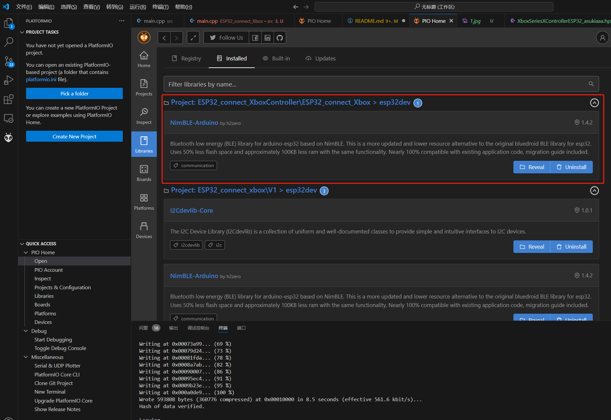
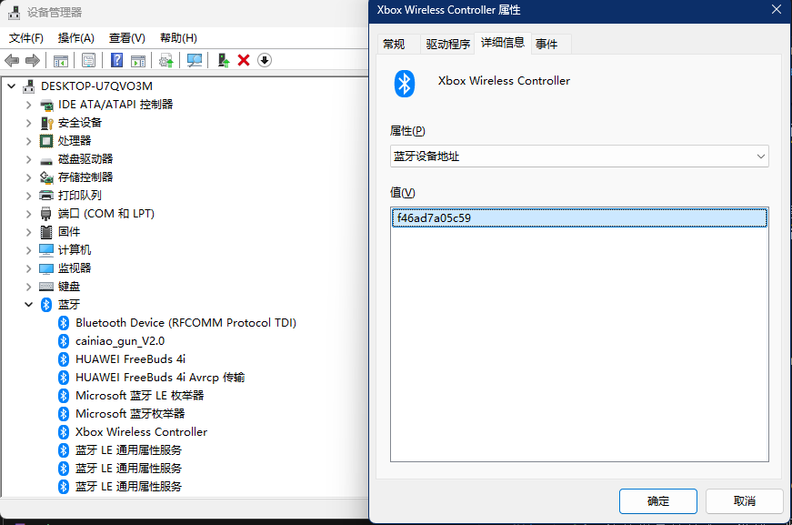

# ESP32_connect_XboxController
演示视频：[【开源】ESP32通过蓝牙连接Xbox手柄读取信号](https://www.bilibili.com/video/BV163eKebExM/?spm_id_from=333.999.list.card_archive.click)

> **仓库介绍：**
> * 使用ESP32蓝牙连接Xbox手柄并读取所有的控制信号
>
>
> **仓库文件：**
>
> * ESP32_connect_Xbox是已验证的示例源码
> * images是贴图，不用管
>
> **环境说明：**
>
> * 开发板：ESP32-WROOM-32E
> * 开发环境：vscode+platformIO
>
---

## 1. 使用说明
* 拉取仓库或者下载压缩包解压后的工程不要整个用vscode打开，进入文件夹里把"ESP32_connect_Xbox"文件夹拖到vscode打开

* 首次打开代码的时候如果环境没问题的话会自动安装蓝牙库，看一下版本对不对，版本不对或者没有安装的话要手动安装，要移植到其它项目记得自己添加这个库

* 需要在代码中替换成自己的xbox手柄蓝牙MAC地址，方法如下：
  >1、用电脑蓝牙连接手柄
  >
  >2、打开设备管理器，找到：蓝牙->Xbox Wireless controller->双击打开->详细信息->属性栏下拉->找到“蓝牙设备地址”->得到地址
  >
  >3、把地址替换代码对应位置 `XboxSeriesXControllerESP32_asukiaaa::Core
    xboxController("f4:6a:d7:a0:5c:59");`

* ### **注意**：
  > 把代码烧录到开发板后，首次连接手柄的时候需要长按手柄顶部的小按钮，让手柄进入配对模式，这时候西瓜灯会闪的飞快，然后就等它跟ESP32配对，成功后第二次就可以直接连了。
  
## 2. DLC
  >2024/8/20更新：支持手柄振动
  >[源例程参考](https://github.com/asukiaaa/arduino-XboxSeriesXControllerESP32/tree/main/examples/vibration)

  #### 测试结果：（详看代码，欢迎补充和更正）
  支持四种振动模式
   * left：上左电机动
   * right：上右电机动
   * center：下左电机和下右电机一起动，频率高力量小
   * shake：下左电机和下右电机一起动，频率低力量大
  
  特性
   * 四种模式都可以调振动力度
   * 下左电机和下右电机是绑定的，只能一起动，但是提供了两种振动模式，个人猜测是两种模式的原是同给电机不同的电压
   * 四种模式可以随意搭配使用，但center和shake一起用的话执行的应该是shake

---

> 感谢大佬的开源库：
>
> [arduino-XboxSeriesXControllerESP32 (XboxSeriesXControllerESP32_asukiaaa) (github.com)](https://github.com/asukiaaa/arduino-XboxSeriesXControllerESP32)
>
> [arduino-XboxSeriesXReportBuilder(XboxSeriesXHIDReportBuilder_asukiaaa) (github.com)](https://github.com/asukiaaa/arduino-XboxSeriesXHIDReportBuilder)
>
> [arduino-XboxControllerNotificationParser  (github.com)](https://github.com/asukiaaa/arduino-XboxControllerNotificationParser)
>
